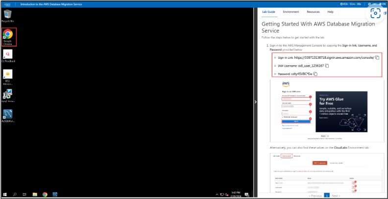
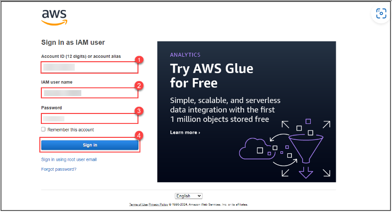
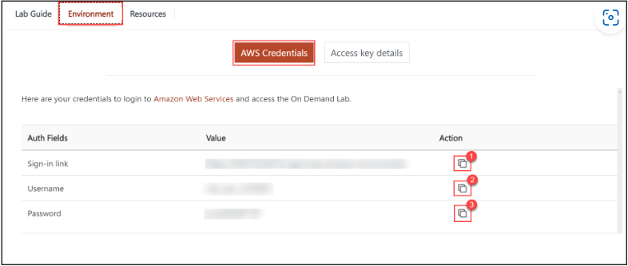
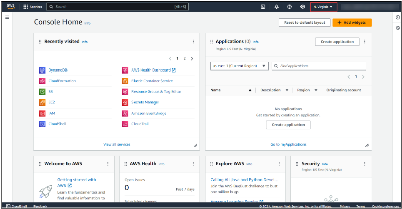

## Getting Started With AWS Database Migration Service

Follow the steps below to get started with the lab.

1. Open Google Chrome in Windows EC2 Instance (LabVM) and sign in to the AWS Management Console by copying the Sign-in link, Username, and Password provided below.
<strong>
   - Sign-in Link:
   - IAM Username:
   - Password:
</strong>

Alternatively, you can also find these values on the **CloudLabs** Environment tab.

2. After signing in to the AWS Management Console, choose the region **US-EAST-1** (N. Virginia) from the drop-down menu.

**Note**: You can deploy the resources in any of the six regions mentioned below:
<strong>
   - us-east-1 (N. Virginia)
   - us-east-2 (Ohio)
   - us-west-2 (Oregon)
   - eu-central-1 (Frankfurt)
   - eu-west-2 (London)
   - ap-southeast-1 (Singapore)
</strong>