## Exercise 2: Use MySQL Workbench To Connect To Your Pre-Created RDS (Aurora) Instance

In this exercise, you will be connecting your pre-created RDS (Aurora) Instance using the MySQL Workbench Application.

1. Open the MySQL Workbench Application on the LabVM, and on the MySQL Workbench homepage, click on the plus icon to add a new database connection.

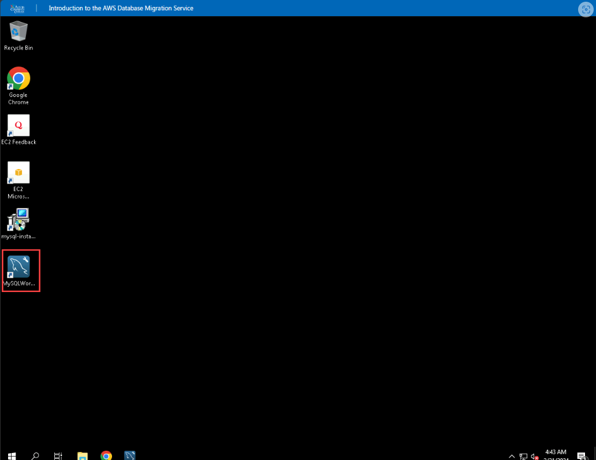

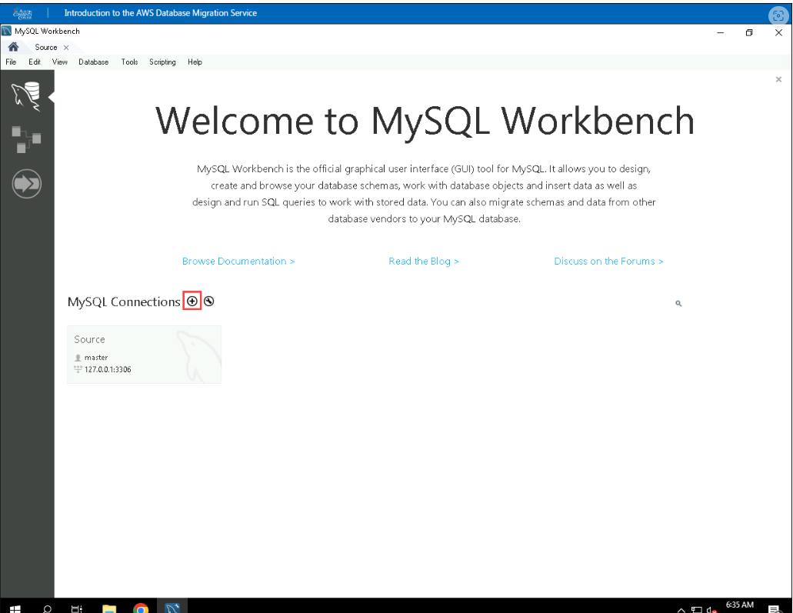

2. Provide the below details in the opened Setup New Connection dialog box:
- For the Connection Name, enter Aurora.
- For the Username, enter
- For the Hostname, enter cluster endpoint
- For the Password, click on Store in Vault and enter , and then click OK.

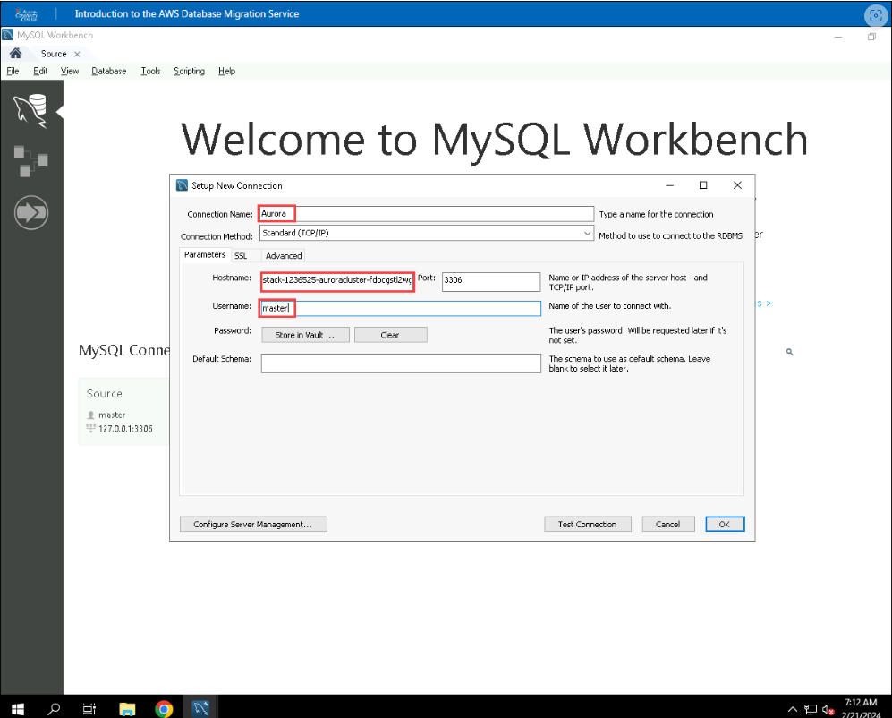
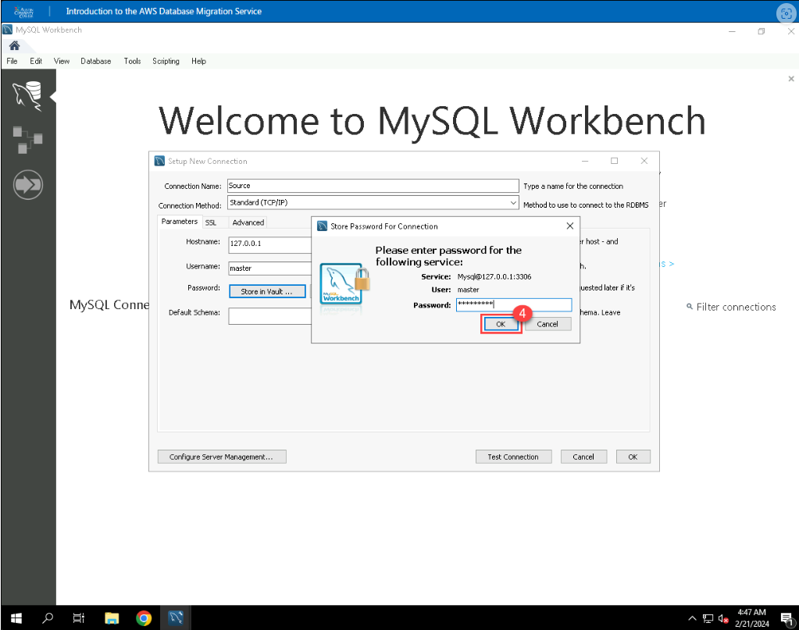

3. Click on Test Connection to verify whether the connection with MySQL is successful or not, and then click OK.

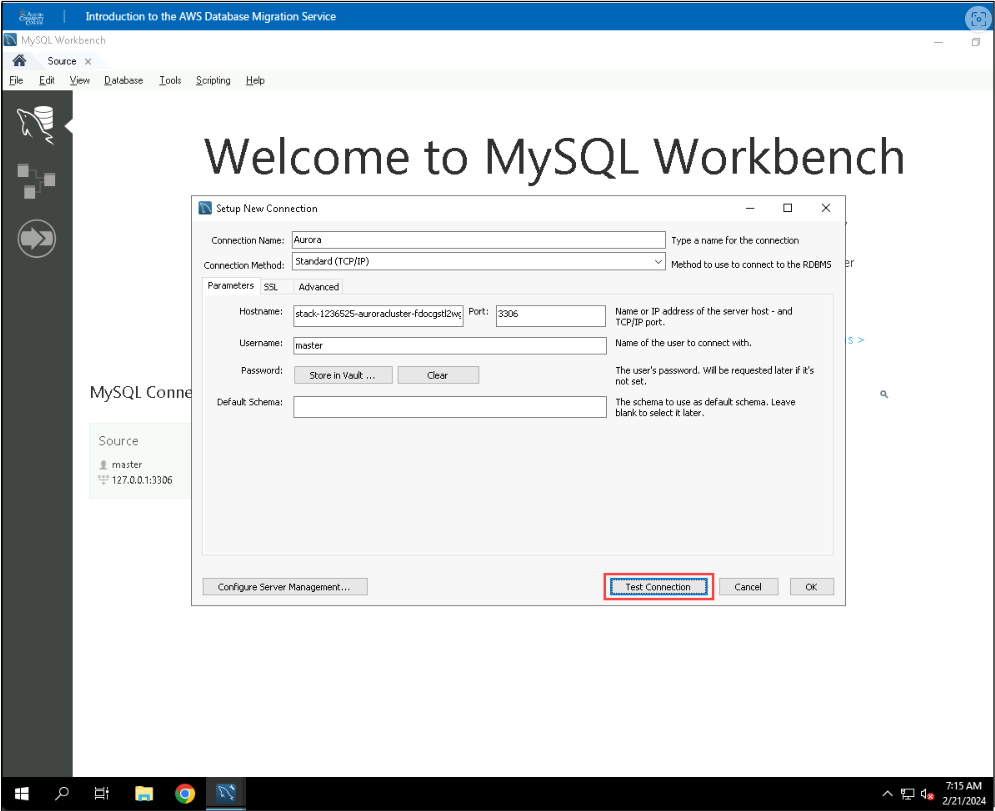

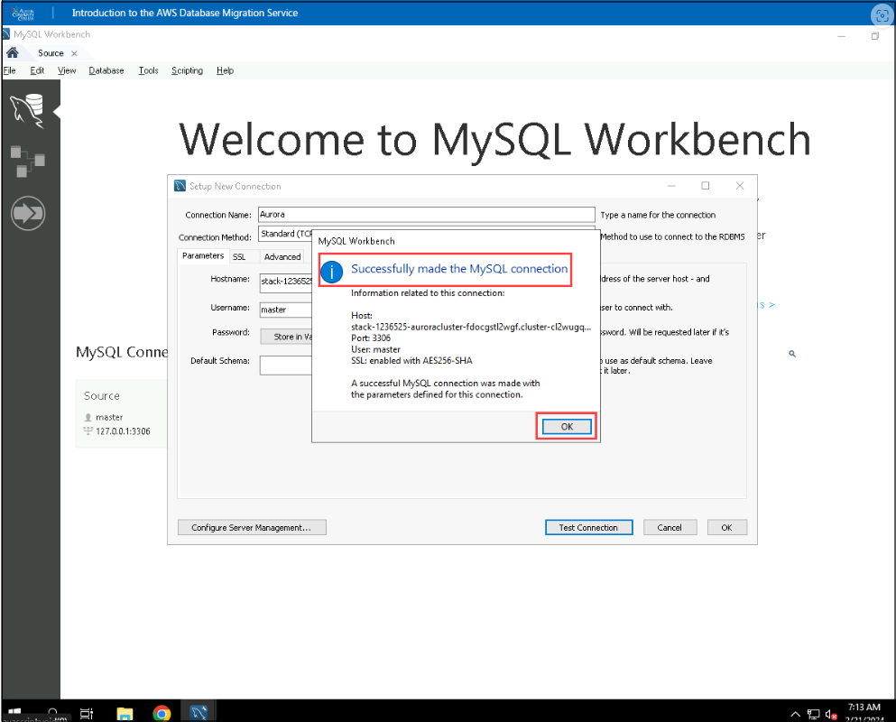

4. Click OK to save the connection details and verify that the connection is named Aurora.

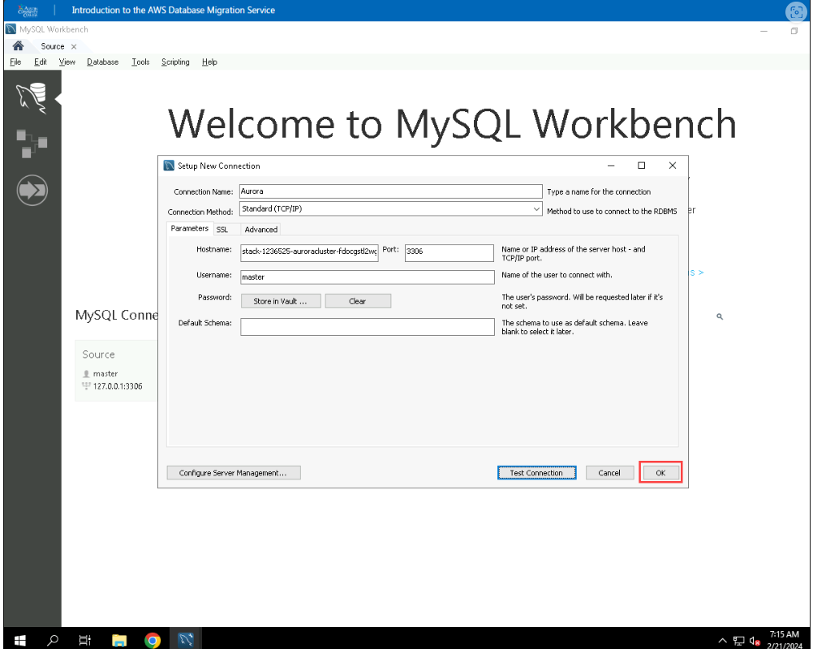

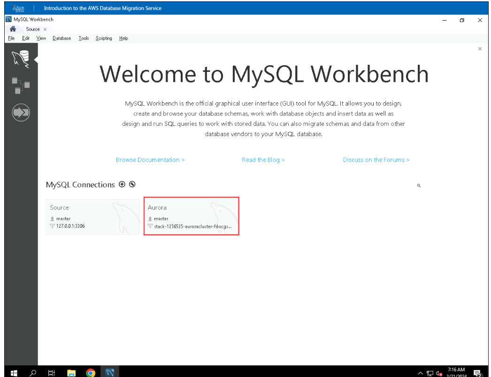

5. Double click on connection Aurora to open a Query Editor.

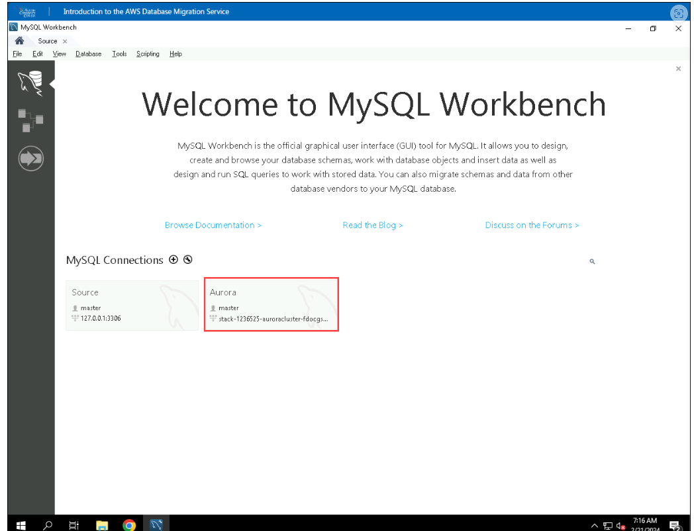

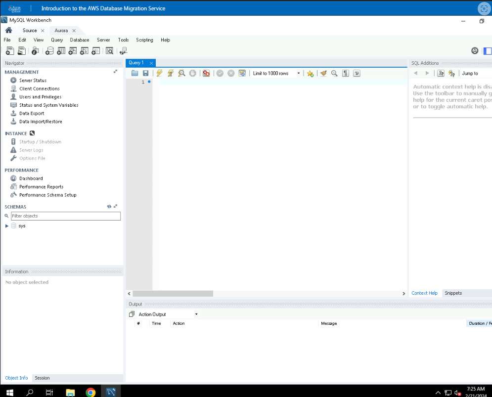

6. In the Query Editor, execute the following query to verify that no data exists in your Aurora instance.

~~~~sql

Select * from mydb.employee;
~~~~
ou should receive a message showing that mydb.employee does not exist.Y

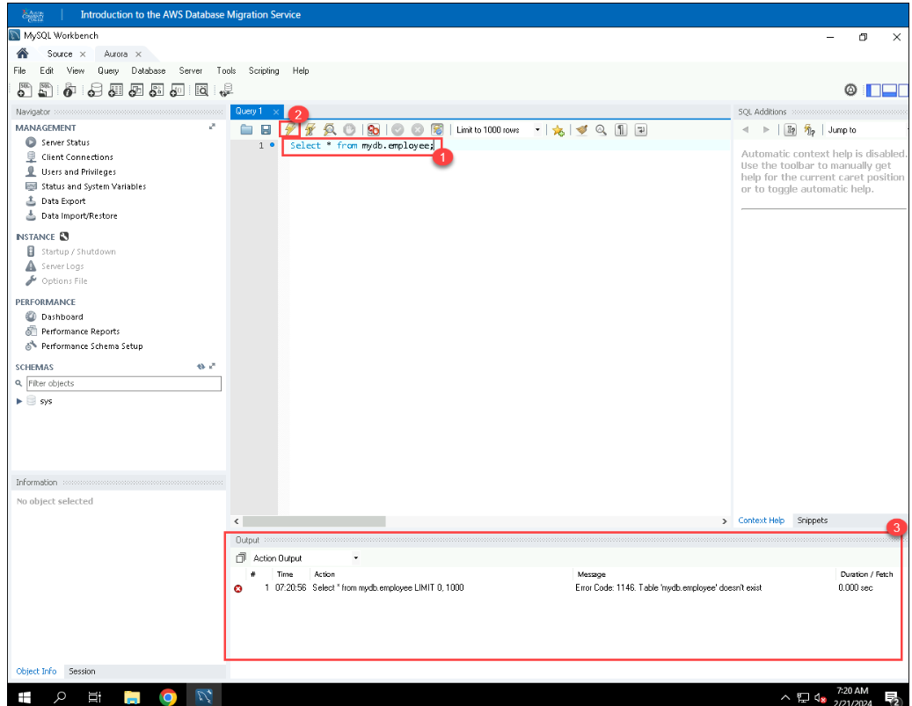

