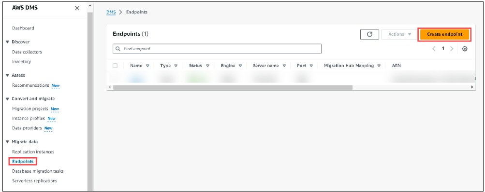
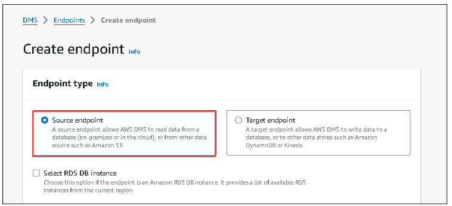
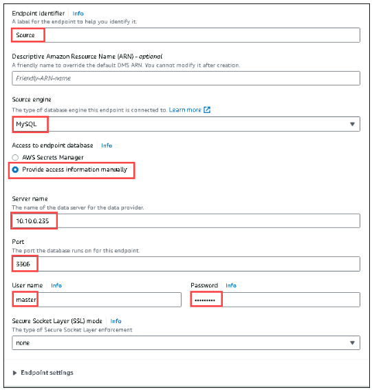

## Exercise 4: Create Your Source Endpoint

In this exercise, you will be creating a source endpoint. An endpoint provides connection, data store type, and location information about your data store. The AWS Database Migration Service uses this information to connect to a data store and migrate data from a source endpoint to a target endpoint. You can specify additional connection attributes for an endpoint by using extra connection attributes. These attributes can control logging, file size, and other parameters; for more information about extra connection attributes, see the documentation section for your data store.

Follow the below steps to configure the source endpoint:

1. On the AWS DMS page, open the navigation page on the left, click on the Endpoints (1), and Create endpoints (2).

2. Provide the below values while configuring the endpoint.
- For the endpoint type, choose Source endpoint.

- For the Endpoint identifier, enter Source.
- For the Source engine, enter MySQL.
- For the Access to endpoint database, choose Provide access information manually.
- For the Server name, enter .
- For the Port, enter 3306.
- For the User name, enter .
- For the Password, enter .

3. Scroll down to the Test endpoint connection:
- For the VPC, choose the VPC that contains clgVpc in it.
- Click on Run Test, and if the status is successful, then click on the Create endpoint.

