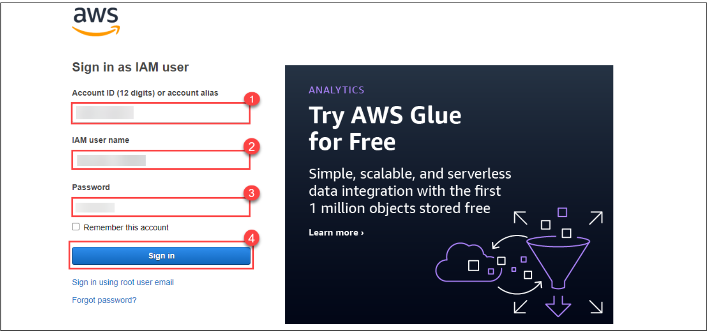

# Creating EC2 and RDS

Follow the steps below to get started with the lab.

1. Sign in to the AWS Management Console by copying the Sign-in link, Username, and Password provided below.
   - Sign-in Link: 
   - IAM Username:
   - Password:

Alternatively, you can also find these values on the CloudLabs Environment tab.

2. After signing in to the AWS Management Console, choose the region US-EAST-1 (N. Virginia) from the dropdown menu.

Note: You can deploy the resources in any of the six regions mentioned below:
- us-east-1 (N. Virginia)
- us-east-2 (Ohio)
- us-west-2 (Oregon)
- eu-central-1 (Frankfurt)
- eu-west-2 (London)
- ap-southeast-1 (Singapore)
