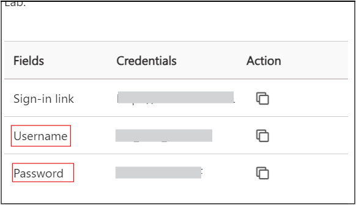
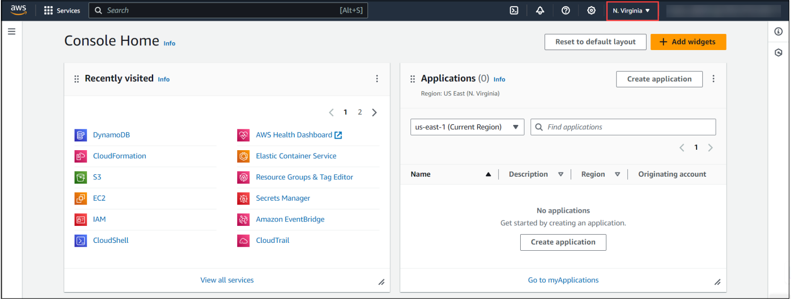

# Creating an Amazon EC2 Instance and RDS instance

Follow the steps below to get started with the lab.

1. Login to AWS console with the link(https://console.aws.amazon.com/console/home) and by using the environment creds you can login to the aws console.
   

2. After signing in to the AWS Management Console, choose the region US-EAST-1 (N. Virginia) from the dropdown menu.

   
