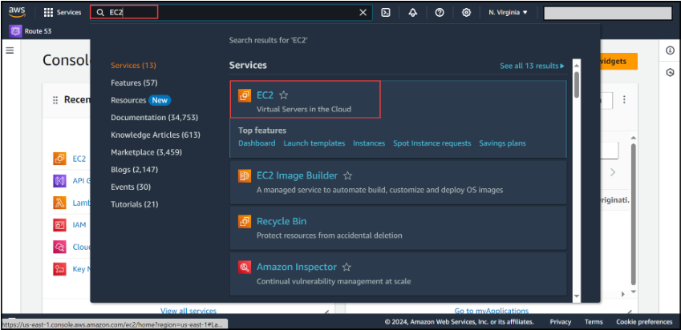
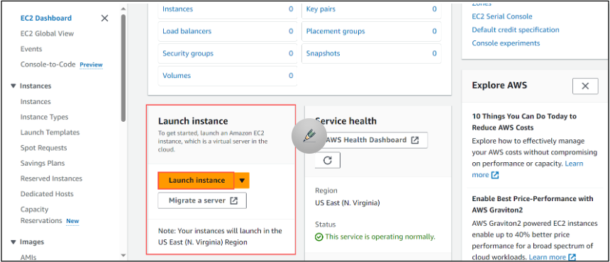
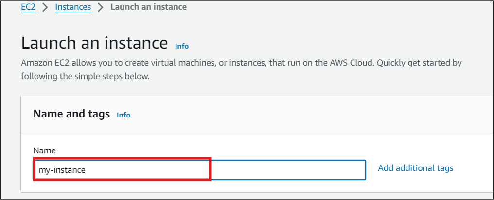
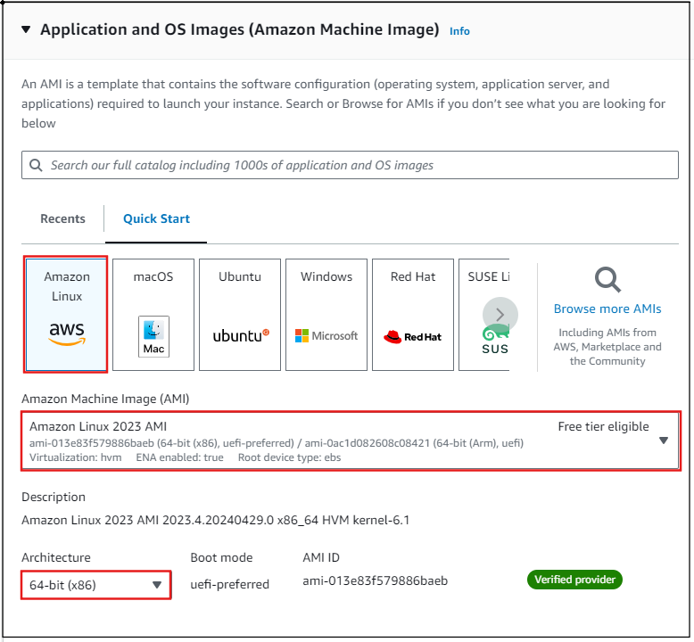
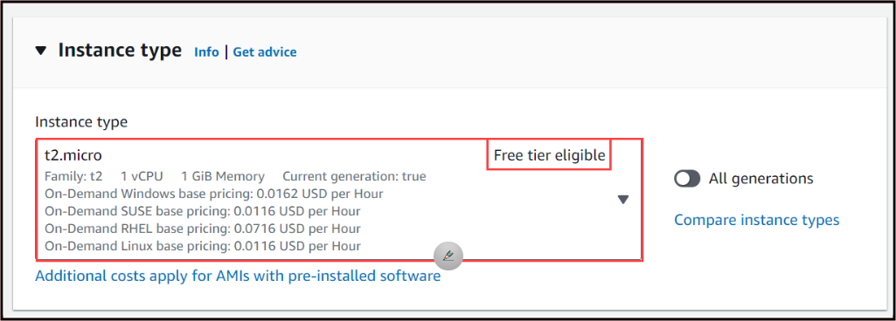
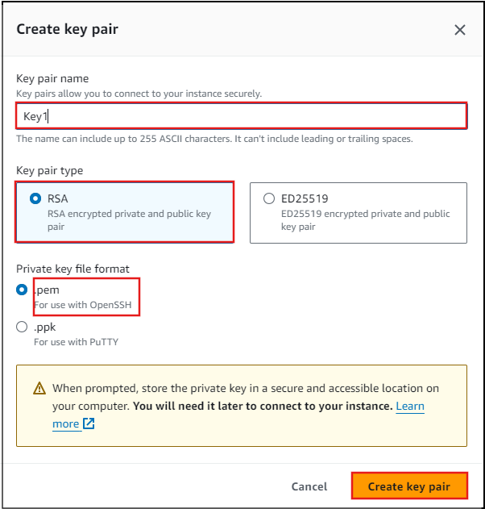
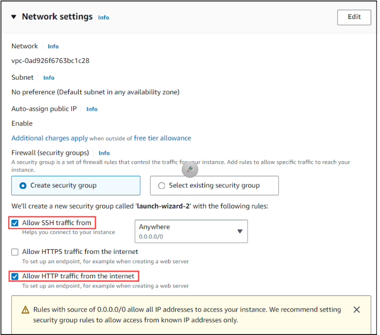
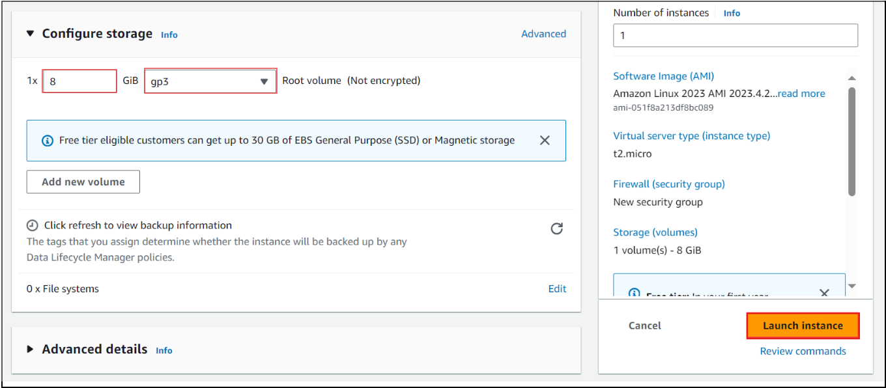
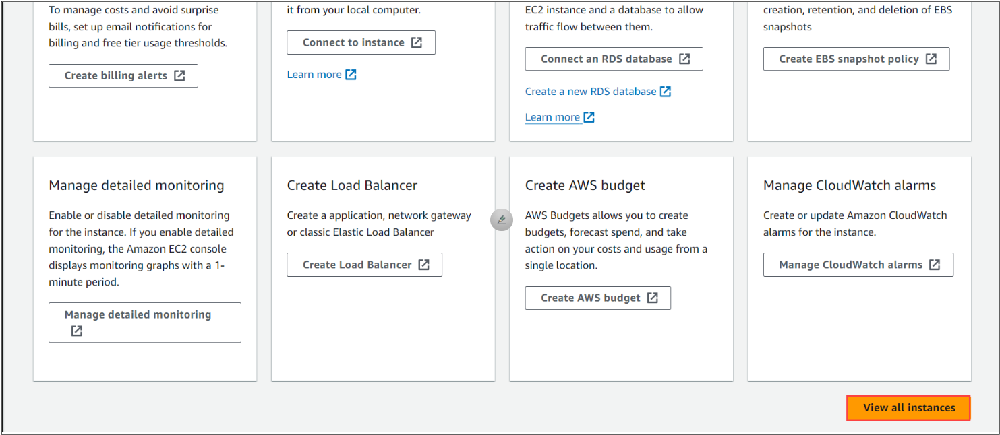
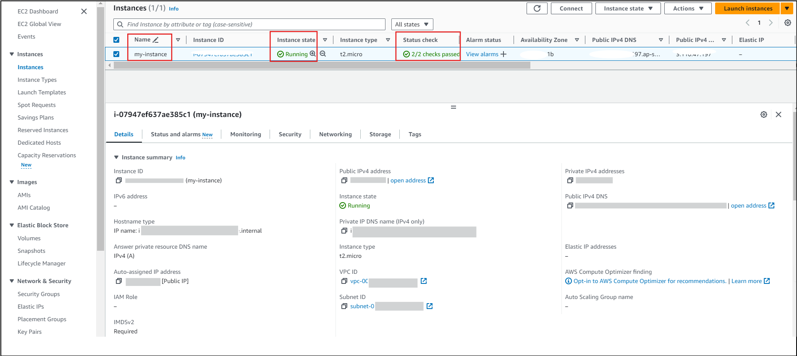

## Exercise 1: Creating an EC2 Instance

In this task, you will be creating an EC2 instance in the public subnet of your VPC for it to access the internet. To create the EC2 instance, follow the given steps below:

1. On the AWS homepage, click on the search bar, and enter **EC2** and select the AWS EC2 service as displayed in the results.

2. You will be directed to the EC2 Dashboard page.
Select Launch Instance to create an instance.

3. On the page named **Launch an EC2**, under Name and tags field, give the Name as **"my-Instance"**

4. Under Application and OS Images (Amazon Machine Image) section,
   - Let Amazon Machine Image (AMI) be default as Amazon Linux 2023 AMI
   - Let Architecture to default as 64 bit.

   
5. Keep Instance type to default as t2.micro 

6. Under Key pair (login), select Create a new key pair and provide Key pair name as Web_Server_Key.
   - Leave other settings to default and select Create key pair.

Note: You will be asked to download the key pair. Download it in a directory where you can access it later.

7. Under Network Settings:
   - Keep Allow SSH traffic from checkbox selected.
   - Select Allow HTTP traffic from the internet checkbox to access any web server instance over HTTP on the internet.
   - Let all other network settings be default.

8. Let all other settings such as **Configure storage** be default and click on  **Launch instance** to launch the instance. Your instance will be launched. 

9. Select **View all instances** to view the running instance.

10. Finally, you can see the instance running in the EC2 Dashboard. Note that, one minute after the instance starts running, the status check appears as **2/2 checks passed**.

Note: You can move forward with the further exercises as you wait for the Status Check to be passed.

<validation step="d0e665af-7b18-4087-8ea5-ebdbe7ed78fc" />

In this exercise, you have successfully created an EC2 instance.
