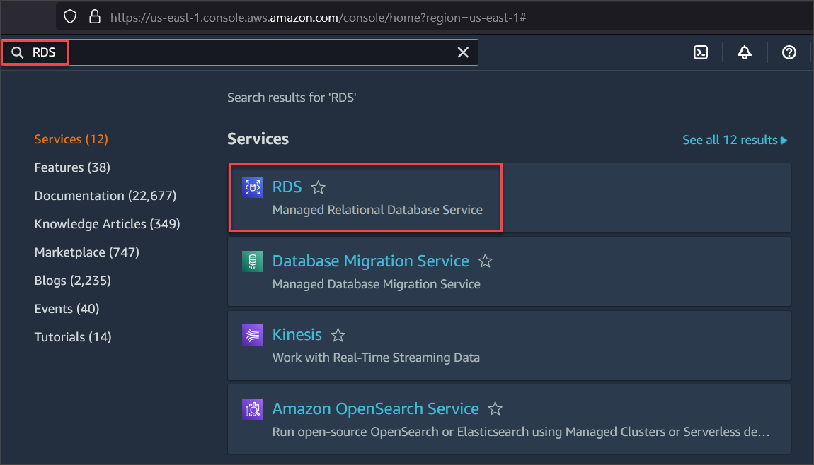
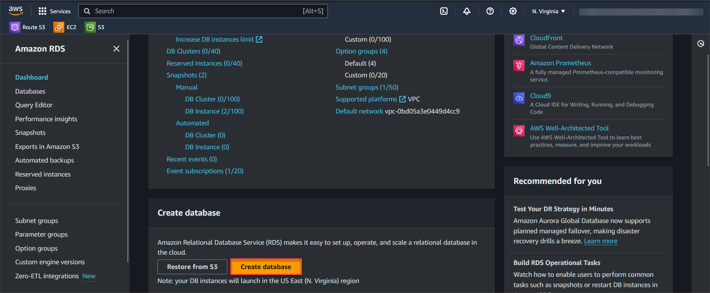
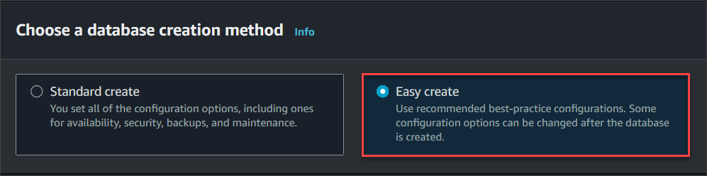
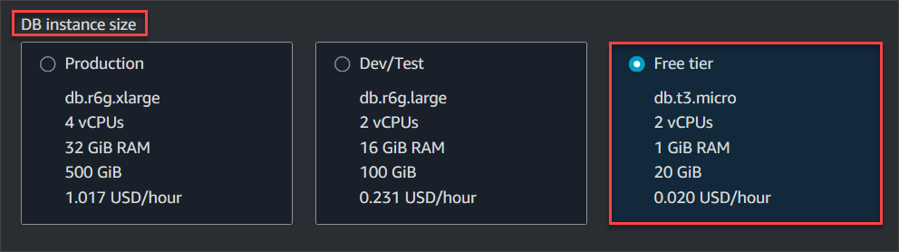
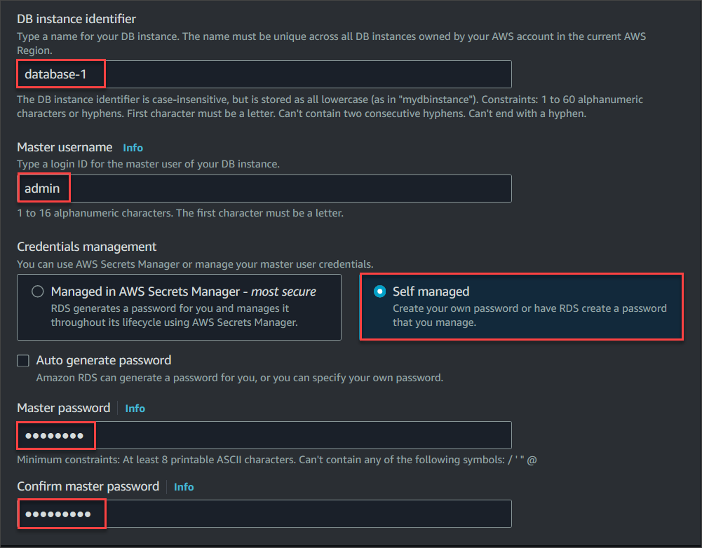
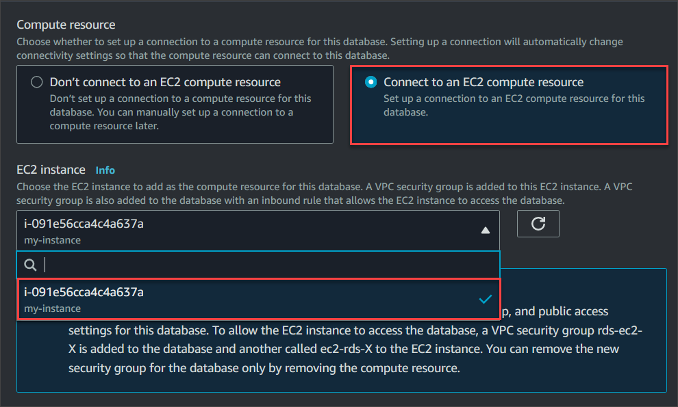
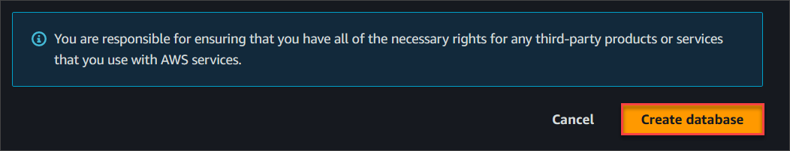
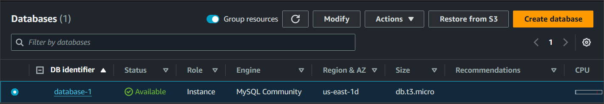
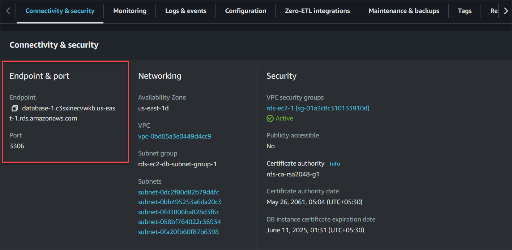

## Exercise 2: Creating an AWS RDS Instance

#### In this task, you will create an Amazon RDS database in the same VPC as your EC2 instance to connect with it.

1. In the unified search bar, type **RDS** and select the RDS service. You will be navigated to RDS dashboard.

    

2. Click on **Create database** to start creating your database.

   

3. Select database creation method to **Easy create**.  Select Free tier in Templates field.

    

4. Under Configuration, select **MySQL** as the Engine type and keep other options as default.

    

5. Select **Free tier** for DB instance size 

    

6. Under the below settings, do the following:
    - Set DB instance identifier to **database-2** or any other name you like, to identify your database instance uniquely over the region in your AWS account.
    - Keep Master username to **'admin'** as default.
    - Keep Credentials management to **'Self managed'** and provide the password as **'admin123'** in the Master password field.
    - Confirm the Password by retyping **'admin123'**

    

7. Click on **Set up EC2 connection** and under it, 
    - Select **Connect to an EC2 compute resource** 
    - In **EC2 instance** field , select the *dropdown menu* and you can view the instance you had created named **"my-instance"**
    - Select the instance which is visible.
    - Note: The database instance will be created in the same VPC where your web server instance is created.

    

8. Click on **Create database**

    

9. You can view the database which is being created. Let the status of the Database be **Available** only then further steps are possible

    

10. Click on the database which is created and copy the Endpoint and port number under Connectivity and security section on a notepad. 

    

<validation step="60e7f64f-7c66-4ad4-ad8d-c62e8a6ea34d" />

In this Exercise you have successfully created a RDS Database
